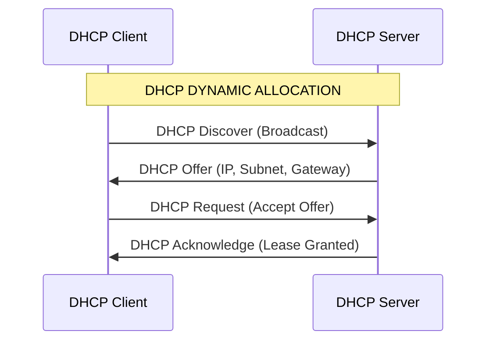

# IPv4 Routing
---
# Chapter 16
```
- Router run IOS and IOS XE as the operating system.
- SOHO routers almost always use the Internet and VPN technology for its WAN connection to send data back and 
  forth to the rest of the enterprise.
- SOHO routers almost always use a multifunction device that does routing, LAN switching, VPN, wireless, and 
  maybe other features.
- Line status refers to layer1 state and protocol status refers to layer2 state.
- Auxilary ports are used to remotely access the CLI with line aux 0 being configured.  
```

### Configuration commands
- (router)#show ip interface brief
- (router)#show interfaces **interface-id**
- (router)#show protocols
- (config-if)#ip address **ip-address mask**
- IOS
	- (config-if)speed auto
	- (config-if)duplex auto
- IOS XE
	- (config-if)negotiation auto

# Chapter 17
```
- Point-to-point serial WAN links use either HDLC (the default) or PPP as the data-link protocol.
- Routing Protocol Code: Default(*), Local(L), Connected(C), Static(S), OSPF(O), RIP(R), BGP(B), EIGRP(D).
- Prefix: Subnet ID.
- Routers use default routes for unknown destination ip packets.
- Host route (/32) defines a route to a single host address.
- Default route: 0.0.0.0/0.
- Routing table's output "Gateway of last resort isn't set" means a default route hasn't been configured.
```
- **Packet Forwarding**
	- If the destination is local, send directly:
		1. Find the destination host’s MAC address from ARP table or ARP discovery.
		2. Encapsulate the IP packet in a data-link frame with the destination address of the destination host.
	- If the destination is not local, send to the default gateway:
		1. Find the default gateway’s MAC address.
		2. Encapsulate the IP packet in a data-link frame with the destination address of the default gateway.
- **Packet Processing**
	- Process it if: 
		1. The frame has no errors (per the data-link trailer).
		2. The frame’s destination data-link address is the router’s address.
	-  De-encapsulate the packet from inside the data-link frame.
	- Compare the packet’s destination IP address to the routing table and find the route that matches the destination address.
	- Encapsulate the packet into a new data-link frame appropriate for the outgoing interface.
	- Transmit the frame out the outgoing interface as listed in the matched IP route.
- **Proxy ARP**
	- A router receives in interface X an ARP request, whose target is not in the subnet connected to interface X.
	- The router has a route to forward packets to that target address, and that route should not forward the packet back out onto the same interface causing a loop. In other words, the router has a useful route to forward packets to the target.
	- The router is therefore willing and useful to act as a proxy for the target host. To do so, the router supplies its own MAC address in the ARP Reply.
   !- Use next-hop based route instead to skip the arp operation.
### Configuration commands
- (router)#show ip route
- (router)#show ip arp
- (router)#clear ip arp **ip-address**
- (config)#ip route **destination mask interface-id** (Interface based route)
- (config)#ip route **destination mask next-hop** **[ad]** (Next-hop based route, AD used to specify the administrative distance)
- (config)#ip route 0.0.0.0 0.0.0.0 **next-hop** (default route)

# Chapter 18
```
- Subinterfaces are router's virtual interface.
- ROAS relies on static trunk configuration on both the router and switch as the router interfaces don't 
  negotiate trunking.
- Network designers choose to use Layer 3 switches for most inter-VLAN routing than ROAS.
- Layer 3 routing logic forwards IP packets between VLANs by applying IP routing logic to IP packets sent by the 
  devices in those VLANs.
- For any topologies with a point-to-point link between two devices that do routing, a routed interface works 
  better. For any other topology SVIs are a must.
```
- **VLAN Routing With :**
	- **ROAS**
		- Roas is used to route between multiple Vlans using a single interface on the router and switch.
		- The switch interfaces configured as a regular trunk.
		- The router interface is configured using **subinterfaces**, configure the Vlan tag & IP address on each interface.
		- The router will behave as if frames arriving with a certain Vlan tag have arrived on the subinterface configured with the vlan tag.
		- The router will tag frames sent out of each subinterface with the Vlan tag configured on the subinterface.
	- **Layer 3 Switch SVIs**
		- Create one virtual interface per vlan.
		- Configure the virtual interface's ip address followed with **no shutdown** command.
		- Older switches models do not support IP routing until you reprogram the switch’s forwarding ASIC (hardware engine).
	- **Layer 3 Switch Routed Ports**
		- On a routed port the switch does not perform Layer 2 switching logic on that frame. Instead, frames arriving in a trigger the Layer 3 routing logic.
		- Once the port is acting as a routed port, think of it like a router interface. That is, configure the IP address on the physical port.
		- **Layer 3 EtherChannel**
			- Works with routed ports, must be configured as follows: 
				1. **No switchport** to make the interface a routed port.
				2. Add the interface to the channel group.
				3. Add the **no switchport** on the **port-channel** interface, then configure the ip address.
			!- The IP address should be placed on the PortChannel interface only.
	- **Router Switched Ports**
		- Consists of using NIMs/switch ports to perform same logic as layer 2 switch by configuring SVIs : 
			- Configure VLANs and assign access VLANs to the switch ports :
				1. **vlan** vlan-id command in global configuration mode to create each VLAN.
				2. **switchport access vlan** vlan-id command in interface configuration mode on the switched interfaces to assign the correct access VLAN.
				3. **no shutdown** command in interface configuration mode to enable the interface.
			- Configure an SVI interface for each VLAN used by the switch ports :
				1. **interface vlan** vlan-id command in global configuration mode to create a VLAN interface. Use the same number as the VLAN ID.
				2. **ip address** address mask command in VLAN interface configuration mode to assign an IP address and mask to the interface, enabling IPv4 processing on the interface.
				3. **no shutdown** command in interface configuration mode to enable the VLAN interface.
			- Configure any routed interfaces with IP addresses :  
				1. **ip address** address mask command in interface configuration mode to assign an IP address and mask to the interface, enabling IPv4 processing.
				2. Configure any routing protocols as needed.
		- Use **show interfaces status** command to identify the switch ports or confirm by trying to configure commands supported only on switched ports or routed ports.

#### Troubleshooting
- **ROAS**
	- Ask questions about the configuration:
		1. Is each non-native VLAN configured on the router with an **encapsulation dot1q** vlan-id command on a subinterface?
		2. Do those same VLANs exist on the trunk on the neighboring switch (**show interfaces trunk**), and are they in the allowed list, not VTP pruned, and not STP blocked?
		3. Does each router ROAS subinterface have an IP address/mask configured per the planned configuration?
		4. If using the native VLAN, is it configured correctly on the router either on a subinterface (with an **encapsulation dot1q** vlan-id **native** command) or implied on the physical interface?
		5. Is the same native VLAN configured on the neighboring switch’s trunk in comparison to the native VLAN configured on the router?
		6. Are the router physical or ROAS subinterfaces configured with a **shutdown** command?
	- Use **show ip route** and **show vlans** to verify ROAS configuration. 
- **SVI**
	- *Autostate*
		- The VLAN must be defined on the local switch (either explicitly or learned with VTP).
		- The switch must have at least one up/up interface using the VLAN, including:
			1. An up/up access interface assigned to that VLAN.
			2. A trunk interface for which the VLAN is in the allowed list, is STP forwarding, and is not VTP pruned.
		- The VLAN must be administratively enabled (that is not shutdown).
		- The VLAN interface must be administratively enabled (that is not shutdown).
	- *No Autostate*
		- The switch checks only whether the VLAN is defined on the switch. It ignores all the other checks performed when using autostate.
		- If no matching VLAN exists, the switch places the VLAN interface in an up/down state.
- **Layer 3 EtherChannel**
	- Look at the configuration of the channel-group command
	- Check a list of settings that must match on the interfaces to work correctly.
### Configuration commands
- *ROAS*
	- (config-subif)#encapsulation dot1q **vlan-id** [native]
	- (config-subif)#ip address **ip-address net-mask**
- *SVI*
	- (config)#ip routing
	- (config)#interface vlan **vlan-id**
	- (config)#show ip route connected
	- (config-if)#[no] autostate
- *Routed Ports*
	- (config)#no switchport
	- (config)#show interfaces **interface-name** switchport

# Chapter 19

```
- DHCP uses DORA messages between the client and server.
- Before a host gets an ip address, it reveives packets through 0.0.0.0 & 255.255.255.255 addresses.
- If the DHCP process fails for a client, hosts have a default means to self-assign an IP address using APIPA.
- APIPA address is from within a subset of the 169.254.0.0 Class B network, along with default mask 255.255.0.0.
- DHCP server config contains Subnet ID and mask, Reserved addresses, Default router, DNS IP address, Pool.
- DHCP uses three allocation modes : Dynamic, automatic, static.
```

- **DORA**
	- *Discover :* Sent by the DHCP client to find a willing DHCP server.
	- *Offer :* Sent by a DHCP server to offer to lease to that client a specific IP address (and inform the client of its other parameters)
	- *Request :* Sent by the DHCP client to ask the server to lease the IPv4 address listed in the Offer message.
	- *Acknowledgement :* Sent by the DHCP server to assign the address and to list the mask, default router, and DNS server IP addresses



- **APIPA** 
	- When client cannot reach the DHCP server, the host assigns itself an **APIPA address**.
	- The client chooses any IP address from network 169.254.0.0 (actual address range: 169.54.1.0 – 169.254.254.255).
	- The DHCP client discovers if any other host on the same link already uses the APIPA address it chose by using ARP to perform Duplicate Address Detection (DAD). If another host already uses the same address, the client stops using the address and chooses another.
	- The client can send/receive packets on the local network only.
- **DHCP Relay**
	- The **ip helper-address** server-ip subcommand tells the router to do the following for the messages coming in an interface, from a DHCP client:
		1. Watch for incoming DHCP messages, with destination IP address 255.255.255.255.
		2. Change that packet’s destination IP address to the address of the DHCP server (as configured in the ip helper-address command).
		3. Route the packet to the DHCP server.
- **DHCP Client**
	- Switches can lease addresses when configured with **ip address dhcp** interface subcommand followed by **no shutdown**.

### Configuration commands
- (config)#ip helper-address **server-ip** (identifies the DHCP server by its IP address)
- (config-if)#ip address dhcp 
- (config)#show dhcp lease

# Chapter 20
```
- Check IP addressing problem, IP mask problem, DHCP problems, VLAN trunking problems, LAN problems ping failure.
- Standard ping is issued from a host, tests its IP config.
- Reverse ping is issued from the router, tests routing back to the host.
- Traceroute triggers ICMP TTL Exceeded error message from routers.
```